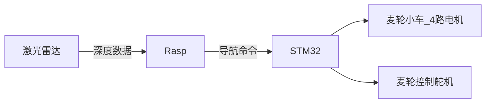

## 机器人结构

目前先实现导航，机械臂控制和摄像头输入尚未确定



### 导航命令接口

Rasp处理激光雷达的数据，建图，优化后，发送给stm32预先约定好的命令

stm32将命令保存在一个队列结构中，依次执行每个命令（每个命令的执行时间一样）


目前定义了如下命令

命令以	0x00开始

以		0xFF结束

- 直行			

​	参数1:速度 	usize	速度参数只是一个档位，不代表具体的物理速度,目前定义八个档位

​	参数2:方向	 bool	 true代表向前

​	串口传出0x01	speed(0~0x10)	direc(0x00 or 0x01)

- 转向（原地）		

   参数1:方向	bool 	true代表顺时针

  串口传出0x02	direct(0x00 or 0x01)

- 停驻                

​	串口传出0x03        

比如以档位7前运动，则串口传出命令

```shell
00000000 	//命令开始
00000001 	//指定直行命令
00000111 	//指定速度
00000000	//指定方向
11111111	//命令结束
```

## Rasp建图介绍

ROS为Ros2-humble

激光雷达采集使用厂家提供的驱动

建图采用cartographer

导航使用navigation2

```待续
```


​	